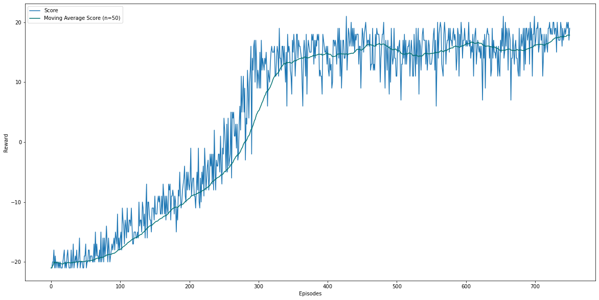
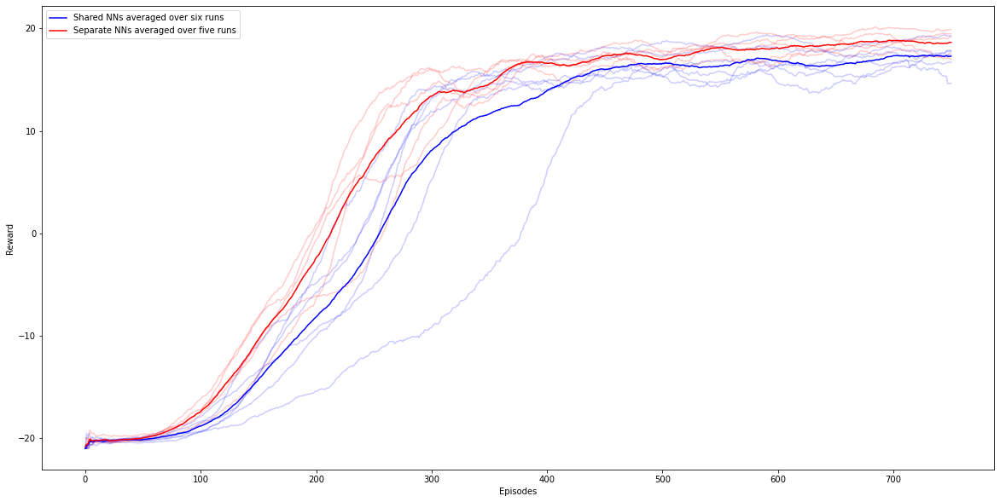

# Deep Reinforcement Learning with Pong

In this project, I implemented a (threaded) Deep Reinforcement Learning model for Atari's [Pong](https://www.gymlibrary.dev/environments/atari/pong/), where the agent learns to play by himself, using [Proximal Policy Optimization](https://arxiv.org/pdf/1707.06347.pdf). Exemplary run:

As Pong has 21 rounds and a game is won if one player reaches 21 points, the reward is in between 21 (computer does not score any point) and -21 (agent does not score any point). \
It can be observed that the actor wins after approximately 300 games, where he also learns the fastest. The algorithm uses a MLP neural network with one hidden layer having 512 neurons. 

The accompanying paper furthermore analyses the stability of results over several runs and compares the two different cases of shared neural network architecture (actor and critic share the same neural network) and separate neural network architecture (actor and critic have two separate networks). As [Huang et al. (2022)](https://iclr-blog-track.github.io/2022/03/25/ppo-implementation-details/) already found for non-Atari environments, this improves performance. This is also the case for my implementation: 

Further information can be found in the paper and in the code. The hyperparameters were set as visible in the code. Differing configurations were explained in the paper. 

The code also features the render function, where you can watch the agent play once you have trained it. Environment info can be found in requirements.txt

Have fun!